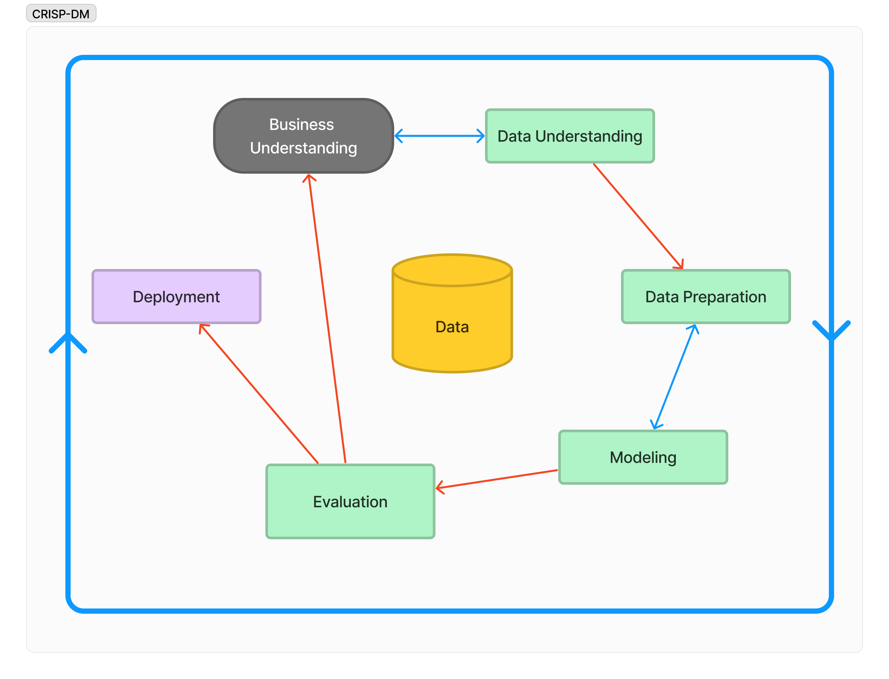
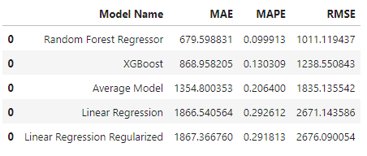
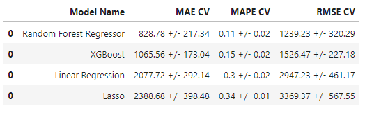

# Rossmann Prediction Project
## What's this project about?
The idea of this project is to go through a full cycle of the **CRISP-DM** methodology using a complex database, focusing on the commercial use of some of the data science skills I'm learning.  
  
The database chosen for this project was from the [Rossmann Store Sales Kaggle competition](https://www.kaggle.com/c/rossmann-store-sales). Here we have a full database of over 4000 drug stores in Europe, and a sample of over 1 million days, and their financial results during those days.

## How does the CRISP-DM methodology works?

Just like many of the tech-based project management methodologies, **CRISP-DM** is an iterative cycle, where after each iteration we end up with more business knowledge of the problem at hand and a better deployed model.  

Here's a flowchart on how the cycle works:

This was the structure used to dictate the approach to the project.  

## What about the technology applied?

It is important to emphasize that all the coding done here is in **Python**. I'd also use a little bit of SQL in this type of project for the data requisition part, but it was not necessary, seeing as all the data came in some csv files from the Kaggle competition.

### How have you done your data manupulation?
We've mostly used the **pandas** library to read and manipulate the database. Here we changed some things, such as:  
1. Removing missing/unusable data
2. Filling out NAs
3. Changing data types to more usable ones
4. Separating the 'date' attribute into year/month/day/week of year columns

We also used the **Pyplot** library from **Matplotlib** and **Seaborn** libraby to graph some data to better understand it. It's in the notebook as an EDA section.  

For the data preparation part, we've used the following methods:
1. **Robust Scaler** (from sklearn.preprocessing) to rescale columns with outliers
2. **Min Max Scaler** (also from sklearn.preprocessing) to rescale columns with 
3. **One Hot Encoder** using pd.get_dummies 
4. **Label Encoding** for categorical non-linear data
5. **Ordinal Encoder** for linear categorical data

After many changes in the dataset and many questions asked and answered, we came across a clean and usable dataset that's ready for some machine learning algorithms.

### So it's finally Machine Learning time?!

Yes and no. First, we need to find out what part of this robust dataset we'll use. And that was done using **Boruta**, which is a feature selection algorithm based on the **Random Forest Regressor**. It intends to tell you which of the variables are the best to be used for this project.  

The algorithm confirmed the effectiveness of 18 out of the 26 available features. Mixing Boruta's results with the EDA previously done, we ended up with 20 features.

### You're not telling me another step before the part I'm actually here for, are you?

It is Machine Learning time. We've used a feel different approaches to decide which algorithm we'd use. Here's what we tested:  
1. Simples average - to be used as a baseline
2. **Linear Regression** - that would've worked well if the data was linear
3. **Lasso regularized Linear regression** - that works better with outliers than the simple linear one, but also needs the data to be linear
4. **Random Forest Regressor** - great tree based model, performs great, but generates very heavy models
5. **XGBoost**  - a boosted tree algorithm that performs really well

Here's the first error table with these algorithms, using as error metrics MAE, MAPE, and RMSE:

We can see here that the linear regression models are outperformed by the average model, meaning our data is definitely NOT LINEAR.  

Right after that we confirmed the **Random Forest Regressor** and the **XGBoost** methods better performance by creating a **cross-validation** section. Here are the results using 5 iterations:

It is possible to see that our assumption was right on which models would perform well, but now we can see that the error is a bit wider than we anticipated.  

We chose to work with **XGBoost** as our main model. It didn't outperform the Random Forest Regressor, but it is a small model that perform really well and, seeing we'll put it in production in a free environment, it's not possible to use a very large one.

### We're done now?

Nop. There are still some things to do. First of all, we need to do the hyperparameter fine tuning. For that we've done a Random Search, changing six different parameters with a cross-validation process with 3 iterations to tell us the mean error of each one of the 5 random assortments.

After finding out some better hyperparameter, we got a way better result, getting the RMSE index under 1100. With this model saved and transformed into a Pickle file, we created two apps using [Render](https://render.com), a free platform to host apps.  
The first app is based on a python file made to execute this prediction on any given store and the second one is a Telegram bot, so we can request the service at any place and any time.

---

This was a very fun project and I've learned a lot about machine learning, about the CRISP DM cycle and about how to approach this type of projects. I don't think I'll be running any other cycle, but I'll keep the bot up for some time. You can find it searching for @rossmann_salespred_bot at Telegram. 

Any doubts or sugestions, I'm always available at [LinkedIn](https://www.linkedin.com/in/filipesaladini/)
